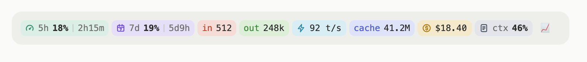
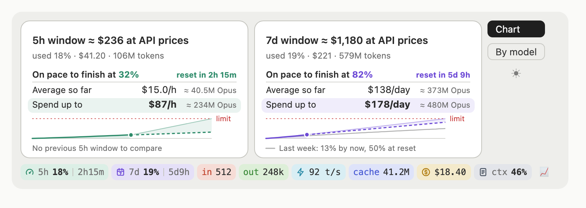
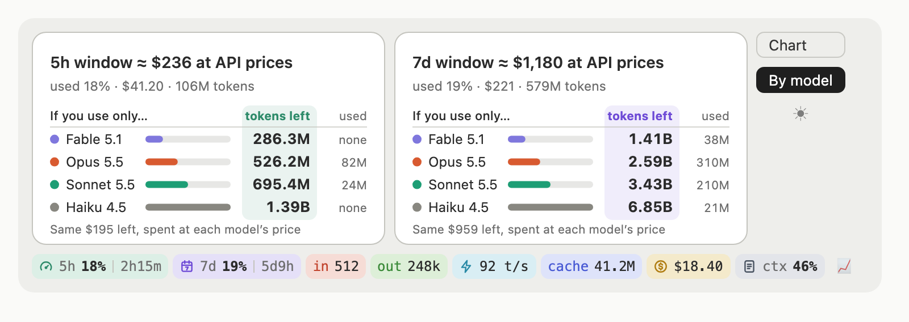

# claude-code-mods

Mods for [Claude Code](https://claude.com/claude-code), distributed as a plugin marketplace:

- [context-band](#context-band): a band above the prompt with rate limits, tokens, speed, cache, cost and context
- [cache-timer](#cache-timer): a countdown to when the conversation's prompt cache expires, before the model name

[中文说明](#中文说明)

## context-band

A band above the prompt, in the desktop app and the CLI, that updates after every turn:

- **5h / 7d** rate-limit usage and the time until each resets
- **in / out** tokens, **t/s** output speed, **cache** tokens and hit rate
- **$** the session's cost at API prices, **ctx** how full the context window is

<picture>
  <source media="(prefers-color-scheme: dark)" srcset="docs/screenshots/band-dark.png">
  
</picture>

The band stays on one line. When some pills don't fit, a **+N** button at the end expands it to show every pill, and **Less** folds it back.

Hover the 5h or 7d pill for a one-line estimate of what that window is worth at API prices. The 📈 button opens two views of both windows:

- **Chart**: where the window ends at your pace (or when you hit the limit), your average spend rate beside the rate that lands on 100% at the reset, and a strip chart against the limit and last week
- **By model**: for each model, the tokens left if you use only that model (with bars to compare), and the tokens it has used

<picture>
  <source media="(prefers-color-scheme: dark)" srcset="docs/screenshots/chart-dark.png">
  
</picture>

<picture>
  <source media="(prefers-color-scheme: dark)" srcset="docs/screenshots/models-dark.png">
  
</picture>

<sub>Screenshots use demo figures.</sub>

In the terminal, 📈 shows the same two views as small tables, one row per window with the columns lined up, and drops the least important columns when the window is narrow.

Installed or reloaded partway through a session (`/reload-plugins`), the band starts from the tokens the session has already used, read from its transcript; t/s appears after the next reply.

The band follows the app's light or dark theme; ◐ (in the 📈 panel) cycles auto, light and dark.

### Install

In Claude Code (CLI or desktop):

```
/plugin marketplace add EricJamie/claude-code-mods
/plugin install context-band@claude-code-mods
```

It loads in the next session.

### Commands

`/context-band auto|light|dark` theme · `hide` / `show` the band · `reset` the token counters

### How the estimates work

- A window runs from its reset time back 5 hours or 7 days.
- **$ at 100%** = what Claude Code spent in the window at API list prices ÷ the % of the window used. Under 5% used it is marked "(rough)".
- **Tokens left if one model does it all** = the dollars left in the window ÷ what a token costs on that model at your own mix of input, output and cache (your last 7 days, priced as if they had all gone to that model).
- Spend comes from the Claude Code transcripts on this machine; usage elsewhere (claude.ai, other machines) counts toward the % but not the $, so the estimates read low if you use those a lot. The estimates assume the limits weigh models by API price.

### Requirements and privacy

- `python3` (the estimator, `plugins/context-band/bin/api_estimate.py`)
- macOS for the automatic theme and the desktop usage history; elsewhere those fall back quietly
- Everything stays on your machine: the mod reads local files and makes no network calls. Its cache is `~/.cache/context-band/`.

### Prices and new models

List prices live in `PRICES` in `bin/api_estimate.py`, from Anthropic's pricing page (https://platform.claude.com/docs/en/about-claude/pricing).

A model the table doesn't know still works: it gets its own row, priced like its family's current model (a new family is priced like Opus), and its figures are marked **≈** until its price is learned. The band learns it from Claude Code's own cost figure for each session, which always uses current prices, set against the tokens each model used in that session. The same check corrects a listed price that has changed. Updating the table when a model ships is still the quickest fix.

### Development

```
claude plugin validate plugins/context-band
CLAUDE_CODE_ENABLE_FUNCTION_HOOKS=1 claude plugin test plugins/context-band
```

Mods are an early-access Claude Code feature; the test runner needs that variable.

## cache-timer

A countdown in the prompt footer, before the model name: `cache 41:41` until the conversation's prompt cache expires. It turns orange in the last sixth of the entry's life (10 minutes of an hour), red in the last 2 minutes, and says `expired` after.

```
/plugin install cache-timer@claude-code-mods
```

Claude Code caches the conversation so far, so each message reads it back instead of sending it again. A cache entry lives a fixed time from the **start** of the last request that read or wrote it, and every message restarts that time. The main conversation uses 1-hour entries on some plans and 5-minute ones on others (subagents use 5-minute ones); the timer reads which from the session's transcript, so it needs `python3`.

Reading the cache is cheap but not free: on Opus 5.5 a cache read costs $0.20 per million tokens against $4 for fresh input, and writing costs 1.25× the input price for a 5-minute entry or 2× for a 1-hour one. Once an entry expires, the next message writes the whole context again: for a 180k-token Opus 5.5 conversation that is ≈ $1.44 instead of a ≈ $0.04 read.

The countdown starts from the main conversation's own requests. Requests it does not see (some background ones) can refresh the cache too, so the real expiry can be a little later than shown.

---

## 中文说明

[Claude Code](https://claude.com/claude-code) 的插件（mod）集合，以插件市场的形式发布：

- **context-band**：输入框上方的状态栏，显示用量限额、token、速度、缓存、花费和上下文
- **cache-timer**：在模型名称前面显示对话缓存到期的倒计时

### context-band 状态栏

显示在输入框上方（桌面端和命令行都支持），每轮对话后自动更新：

- **5h / 7d**：5 小时和 7 天用量限额的使用比例，以及距离重置的时间
- **in / out**：输入、输出 token；**t/s**：输出速度；**cache**：缓存 token 和命中率
- **$**：本次会话按 API 价格计算的花费；**ctx**：上下文窗口的使用比例

<picture>
  <source media="(prefers-color-scheme: dark)" srcset="docs/screenshots/band-dark.png">
  
</picture>

状态栏默认只占一行。放不下的指标会收进末尾的 **+N** 按钮，点击即可展开显示全部，点击 **Less** 收起。

鼠标悬停在 5h 或 7d 上，会显示该窗口按 API 价格折算的估值。点击 📈 打开两个视图：

- **Chart（图表）**：按当前速度到重置时会用到多少（或何时触顶）、目前的平均花费速度和刚好在重置时用满的速度，以及与额度线和上周对比的小图
- **By model（按模型）**：如果只用某个模型还能用多少 token（带对比条），以及该模型已用的 token

<picture>
  <source media="(prefers-color-scheme: dark)" srcset="docs/screenshots/chart-dark.png">
  
</picture>

<picture>
  <source media="(prefers-color-scheme: dark)" srcset="docs/screenshots/models-dark.png">
  
</picture>

<sub>截图中的数字为演示数据。</sub>

在命令行里，📈 用对齐的小表格显示同样的两个视图（每个窗口一行），终端较窄时会先省略次要的列。

如果在会话中途安装或重新加载插件（`/reload-plugins`），状态栏会从对话记录里读出本次会话已用的 token 作为起点；t/s 会在下一次回复后出现。

状态栏会自动跟随应用的浅色/深色主题；📈 面板里的 ◐ 按钮可在自动、浅色、深色之间切换。

### 安装

在 Claude Code（命令行或桌面端）中运行：

```
/plugin marketplace add EricJamie/claude-code-mods
/plugin install context-band@claude-code-mods
```

下一个会话开始生效。

### 命令

`/context-band auto|light|dark` 切换主题 · `hide` / `show` 隐藏或显示 · `reset` 重置 token 计数

### 估算方法

- 窗口从重置时间往前推 5 小时或 7 天。
- **100% 估值** = 窗口内 Claude Code 按 API 价格的花费 ÷ 已用比例。已用不足 5% 时标注"(rough)"，表示还不准确。
- **只用某个模型还能用多少 token** = 窗口剩余金额 ÷ 该模型在你的使用习惯下每个 token 的价格（把你最近 7 天的请求全部按该模型重新计价）。
- 花费来自本机的 Claude Code 对话记录。在其他地方的使用（claude.ai、其他电脑）会占用额度，但不会计入金额，所以如果你经常用这些，估值会偏低。估算假设额度按 API 价格对不同模型加权。

### 依赖与隐私

- 需要 `python3`（估算脚本 `plugins/context-band/bin/api_estimate.py`）
- 自动主题和桌面端用量历史仅支持 macOS，其他系统会自动跳过
- 所有数据都留在本机：插件只读取本地文件，不联网。缓存位于 `~/.cache/context-band/`。

### 价格与新模型

价格表写在 `bin/api_estimate.py` 的 `PRICES` 里，来源是 Anthropic 官方价格页面（https://platform.claude.com/docs/en/about-claude/pricing）。

价格表里没有的新模型也能正常显示：它会有自己的一行，先按同系列当前模型的价格估算（全新系列按 Opus 估算），在价格学到之前数字前会标 **≈**。插件会用 Claude Code 自己统计的每个会话花费（始终按当前价格计算）对照该会话里各模型用掉的 token，自动学出新模型的真实价格；已有模型如果调价，也会被同样校正。新模型发布时更新价格表仍然是最快的办法。

### 开发

```
claude plugin validate plugins/context-band
CLAUDE_CODE_ENABLE_FUNCTION_HOOKS=1 claude plugin test plugins/context-band
```

插件（mod）是 Claude Code 的早期功能，运行测试需要设置这个环境变量。

### cache-timer 缓存倒计时

在输入框下方、模型名称前面显示 `cache 41:41`，即离对话缓存过期还有多久。剩最后六分之一时（1 小时缓存即最后 10 分钟）变橙色，最后 2 分钟变红色，过期后显示 `expired`。

```
/plugin install cache-timer@claude-code-mods
```

Claude Code 会把已有的对话内容缓存起来，之后每条消息直接读缓存，不用重新发送全部内容。每条缓存有固定寿命，从最近一次读写它的请求**开始**时算起，每发一条消息都会重新计时。主对话的缓存，有的套餐是 1 小时，有的是 5 分钟（子代理用 5 分钟）；插件会从本次会话的对话记录里读出是哪一种，所以需要 `python3`。

读缓存很便宜，但不免费：Opus 5.5 读缓存每百万 token $0.20，正常输入是 $4；写缓存是输入价的 1.25 倍（5 分钟缓存）或 2 倍（1 小时缓存）。缓存过期后，下一条消息要把整段上下文重新写入缓存：一段 18 万 token 的 Opus 5.5 对话，这部分费用会从约 $0.04 变成约 $1.44。

倒计时以主对话自己的请求为准。插件看不到的一些后台请求也可能刷新缓存，所以实际过期时间可能比显示的稍晚一些。
